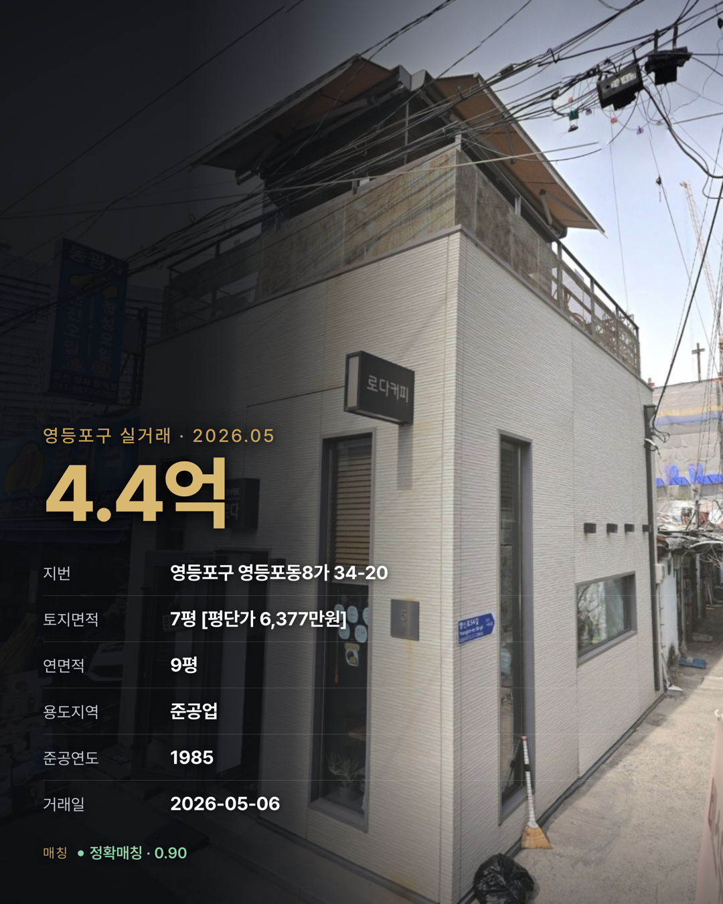

# deal-locator — 상업용 부동산 딜 올인원 MCP

**국토부 공공데이터(실거래가 · 건축물대장)를 공인중개사 실무로 바꾸는 MCP 서버.**
구·동 평단가 시세 조회, 가려진 실거래가가 *어느 건물*인지 특정, 손바뀜 이력 추적,
주소 → 구/동/번지·법정코드·필지 확인, 고객용 데이터카드 자동 제작까지 — **대화 한 줄로.**

> 국토부는 상업용 실거래가의 지번을 `소격동 8*`처럼 **마스킹**해 공개합니다. 남들이
> "어느 건물인지 모른다"에서 멈출 때, deal-locator는 건축물대장 표제부로 **역매칭해 그
> 건물을 되짚고**, 그 위에 시세 · 이력 · 콘텐츠를 얹은 올인원 도구입니다.


---

## 목차

**처음이라면** → [1분 요약](#1분-요약--이게-뭔가요) · [다루는 범위](#다루는-범위-v1) · [설치](#설치) · [도구 6종](#도구-6종)
**쓰다가 막히면** → [매칭 신뢰도](#매칭-신뢰도는-반드시-함께-읽으세요) · [FAQ](#faq) · [한계 · 주의](#한계--주의)

<details>
<summary>전체 목차 펼치기</summary>

- [1분 요약 — 이게 뭔가요?](#1분-요약--이게-뭔가요)
- [다루는 범위 (v1)](#다루는-범위-v1)
- [무엇이 들어있나요](#무엇이-들어있나요)
- [설치](#설치)
- [도구 6종](#도구-6종)
  - [1. `resolve_address` — 주소·필지 확인](#1-resolve_address--주소필지-확인)
  - [2. `deal_card_search` — 매물 종합 확인](#2-deal_card_search--매물-종합-확인)
  - [3. `deal_history` — 실거래가 손바뀜 이력 확인](#3-deal_history--실거래가-손바뀜-이력-확인)
  - [4. `area_scan` — 구/동 실거래가 최신 시세 확인](#4-area_scan--구동-실거래가-최신-시세-확인)
  - [5. `match_explain` — 매칭 근거](#5-match_explain--매칭-근거)
    - [매칭 신뢰도는 반드시 함께 읽으세요](#매칭-신뢰도는-반드시-함께-읽으세요)
  - [6. `deal_card_create` — 데이터카드](#6-deal_card_create--데이터카드)
- [FAQ](#faq)
- [저장소 구조](#저장소-구조)
- [한계 · 주의](#한계--주의)
- [고지](#고지)
- [라이선스](#라이선스)

</details>

---

## 1분 요약 — 이게 뭔가요?

국토교통부 상업업무용 실거래가는 일반건물의 지번을 `소격동 8*` 처럼 가려서 공개합니다.
그래서 "이 건물이 얼마에 팔렸나"를 확인하려면 대장을 일일이 대조해야 했습니다.

이 서버는 **건축물대장 표제부(건축년도 · 연면적 · 대지면적)** 와 **부속지번 대장**으로
역매칭해 그 필지를 특정합니다.

```
소격동 8*  ·  216억 3,842만원  ·  대지 361㎡ / 연면적 356.18㎡ / 1981년
      ↓  표제부 3개 값이 정확히 일치하는 필지는 하나뿐
소격동 86  (북촌로5길 76)  —  정확매칭 0.97
```

모든 수치는 공공데이터포털(data.go.kr) 공식 API 실측값입니다. 결과가 없으면
`[NOT_FOUND]` 를 반환합니다 — **AI가 수치를 지어내지 못하도록** 설계했습니다.

---

## 다루는 범위 (v1)

> **📌 꼭 확인하세요.**

여기서 나오는 시세·평단가는 **전부 통건물(한 필지 위 건물 한 채) 기준**입니다.
구분상가 한 칸 시세나 다른 물건 종류로 인용하면 안 됩니다.

| 구분 | 물건 종류 |
|---|---|
| ✅ 지금 취급 | **통건물(유형 '일반') 상업용건물** 매매 |
| ⏳ 확장 예정 | 토지 · 공장 · 도로 등 |

> ※ 집합(구분상가) 거래는 현재 제외됩니다.

---

## 무엇이 들어있나요

| 구성 | 내용 |
|---|---|
| 조회 도구 5종 | 지번 · 이력 · 지역 스캔 · 매칭 근거 — 전부 읽기 전용 |
| 카드 도구 1종 | 조회 결과를 데이터카드 PNG 1장으로 (고객 제시 · SNS용) |
| 매칭 엔진 | 표제부 역매칭 + 부속지번 재앵커, 단계별 신뢰도 산출 |
| 캐시 | 15분 · 128건 — 같은 지번 재조회는 API를 다시 때리지 않습니다 |

---

## 설치

> **한눈에** — ① 인증키 발급 → ② uv 설치 → ③ 플러그인(권장) 또는 Desktop 등록. 여기까지가 필수입니다.
> ④ 카드 기능 · ⑤ 프리워밍은 선택이니, 급하면 ③까지만 하고 바로 조회하세요.

### 1. 인증키 발급 (필수)

[공공데이터포털](https://www.data.go.kr) 에서 아래 2개를 활용신청하고 **디코딩 인증키**를 받습니다.

- 국토교통부_상업업무용 부동산 매매 신고 자료
- 건축HUB_건축물대장정보 서비스

승인까지 보통 몇 분~1시간 걸립니다.

### 2. uv 설치 (필수)

```bash
curl -LsSf https://astral.sh/uv/install.sh | sh
```

### 3-A. 플러그인으로 설치 (권장 — `/명령어`까지 함께 들어옵니다)

플러그인으로 깔면 MCP 도구 6개와 **슬래시 명령 6개**가 한 번에 붙습니다.

먼저 인증키를 홈 폴더에 파일 하나로 둡니다. 터미널에서:

```bash
echo 'DEAL_LOCATOR_SERVICE_KEY=발급받은_디코딩_인증키' > ~/.deal-locator.env
chmod 600 ~/.deal-locator.env
```

그다음 Claude 에서:

```
/plugin marketplace add syleedlabs/deal-locator-mcp
/plugin install deal-locator@dlabs
```

재시작하면 아래 명령을 바로 쓸 수 있습니다.

| 명령 | 하는 일 |
| --- | --- |
| `/area-scan` | 구·동 통건물 시세와 분기 추이 |
| `/deal-card` | 지번 실거래 한 건 조회 |
| `/deal-history` | 그 지번의 손바뀜 이력 |
| `/match-explain` | 왜 이 건물로 판단했는지 근거 |
| `/resolve-address` | 주소·필지 구성 확인 |
| `/deal-card-image` | 데이터카드 PNG 만들기 |

> 인증키 파일은 `~/.deal-locator.env` → `~/.config/deal-locator/.env` 순으로 찾습니다.
> 프로젝트 폴더에 `.env` 가 있으면 그쪽이 우선입니다.

### 3-B. Claude Desktop 에 직접 등록 (도구만)

설정 → 개발자 → 설정 편집 → `claude_desktop_config.json`

```json
{
  "mcpServers": {
    "deal-locator": {
      "command": "uvx",
      "args": ["--from", "git+https://github.com/syleedlabs/deal-locator-mcp", "deal-locator-mcp"],
      "env": {
        "DEAL_LOCATOR_SERVICE_KEY": "발급받은_디코딩_인증키"
      }
    }
  }
}
```

Claude Desktop 을 재시작하면 도구 6개가 잡힙니다.

> ⚠️ **이 설정 파일에는 인증키가 평문으로 들어갑니다.** 화면 공유·스크린샷·
> 원격지원 때 노출되지 않게 주의하세요. 키가 유출된 것 같으면 공공데이터포털에서
> 즉시 재발급하면 됩니다. 파일에 키를 두기 싫으면 아래 FAQ 의 `.env` 방식을 쓰세요.

### 4. 카드 기능을 쓰려면 (선택)

카드는 브라우저 엔진으로 이미지를 그립니다. 최초 1회만:

```bash
uvx --from git+https://github.com/syleedlabs/deal-locator-mcp playwright install chromium
```

건너뛰어도 조회 도구 5개는 정상 동작합니다.

### 5. 첫 조회를 빠르게 (선택 — 프리워밍)

구·동을 **처음** 조회하면 국토부 API 를 12개월치 받아오느라 20~35초 걸립니다
(한 번 받은 구는 이후 즉시 응답합니다). 미리 채워두려면:

```bash
# 서울 25구 · 12개월치 캐시 채우기 (API 300회, 몇 분 소요 — 한 번만)
uvx --from git+https://github.com/syleedlabs/deal-locator-mcp deal-locator-warm

# 자주 보는 구만:  deal-locator-warm --gus 강남구 성동구 마포구
```

인증키는 조회와 같은 `~/.deal-locator.env` 를 씁니다. 중간에 끊겨도 다시 실행하면
남은 것만 이어서 받습니다. 실거래는 매달 갱신되니, 원하면 월 1회쯤 다시 돌리세요.

---

## 도구 6종

| 도구 | 하는 일 | 이렇게 물어보세요 |
|---|---|---|
| `resolve_address` | 주소 → 구/동/번지 + 법정코드, 필지 구성 확인 | "소격동 86 주소 확인해줘" |
| `deal_card_search` | 지번 하나의 최신 실거래 종합 | "소격동 86 실거래가 알려줘" |
| `deal_history` | 그 지번의 매칭 실거래 이력 전체 | "이 건물 거래 이력 다 보여줘" |
| `area_scan` | 동 단위 평당가 구간 스캔 (지번 몰라도 조회) | "성수동1가 평당 4.5~5.5억 거래" |
| `match_explain` | 매칭 근거 공개 — 표제부값 vs 거래행값 대조 | "이 매칭 왜 이렇게 나왔어?" |
| `deal_card_create` | 데이터카드 PNG 1장 생성 | "이 건으로 카드 만들어줘" |

앞의 5개는 **읽기 전용**입니다. 파일을 만들거나 외부에 무언가를 보내지 않습니다.

각 도구를 **사용방법 → 결과물 → 설명** 순으로 정리한 실행 예시입니다.
값은 전부 공식 API 실측값이며, 표시는 가독성을 위해 정리한 것입니다.

---

## 1. `resolve_address` — 주소·필지 확인

**사용방법**

```
/resolve-address 종로구 소격동 86
```

**결과물**

```
종로구 소격동 86   ·   법정코드 11110-14200
필지 구성: 단일 (부속지번 없음)
```

**설명**

- 다른 조회가 막히기 전에 주소가 제대로 잡히는지 · 합필/부속지번이 있는지 먼저 확인합니다.
- `조회실패` 는 '단일 필지'가 아니라 **미확인**이니 구분해서 읽으세요.

---

## 2. `deal_card_search` — 매물 종합 확인

**사용방법**

```
/deal-card 종로구 소격동 86
```

**결과물**

```
216억 3,842만원    ·    2026-05-14    ·    정확매칭 0.97
대지 361㎡ (109.2평) · 연면적 356.18㎡ (107.7평) · 1981년 준공
대지 평단가 1억 9,815만원/평 · 제1종일반주거 · 매도 법인 → 매수 법인
북촌로5길 76 (소격동)
```

**설명**

- 지번 하나의 최신 실거래를 종합카드 1콜로. 신뢰도(정확매칭 0.97)를 함께 읽으세요.

---

## 3. `deal_history` — 실거래가 손바뀜 이력 확인

**사용방법**

```
/deal-history 성수동1가 685-442
```

**결과물**

```
[성동구 성수동1가 685-442] 매칭 실거래 이력 · 최근 24개월
■ 2026-06-18    57억 5,000만원    정확매칭 0.97    법인 → 법인
■ 2025-11-27    55억 3,000만원    정확매칭 0.97    법인 → 법인
→ 약 7개월 만에 재거래, +2억 2,000만원 (+4.0%)
   대지 136㎡(41.1평) · 연면적 209.34㎡(63.3평) · 1990년 · 제2종일반주거
※ 해제신고 6건 제외
```

**설명**

- 한 지번의 손바뀜을 최신순으로 — 재거래·가격 추이를 한눈에. 건별 신뢰도가 다를 수 있습니다.

---

## 4. `area_scan` — 구/동 실거래가 최신 시세 확인

**사용방법**

```
/area-scan 성수동1가        # 동: 시세 통계 + 개별 거래
/area-scan 성동구           # 구: 구 전체 통계 + 동별 평단가 순위
```

**결과물** — 동을 조회한 최근 한 분기(3개월) 예시입니다.

```
[성동구 성수동1가] 최근 3개월(2026 Q2) · 통건물 12건
대지 평단가    평균 1억 6,028만원 · 중앙값 1억 6,136만원 (p25 1.45억 ~ p75 2.09억)
연면적 평단가   평균 7,770만원 · 중앙값 8,530만원
표본   동 전체 14건 → 집합(구분상가) 2건 제외 · 해제 2건 제외 → 통건물 12건 집계
```

**설명**

- 동을 주면 시세 통계와 개별 거래를, 구를 주면 구 전체 통계와 동별 평단가 순위를 냅니다.
- 동 평균 시세는 국토부 원본 전수에 가까운 `stats` 로 답합니다.
- `coverage`(모수 분해)를 함께 봐야 표본이 대표성을 갖는지 판단할 수 있습니다.

---

## 5. `match_explain` — 매칭 근거

**사용방법**

```
/match-explain 영등포동8가 34-20
```

**결과물**

```
[영등포동8가 34-20] 매칭 근거 · 정확매칭 0.90 (stage2)
거래 4억 4,000만원 · 2026-05-06   (지번 마스킹 '영등포동8가 3*')

  표제부(앵커)   vs   거래행
  연면적    31.21㎡   =   31.21㎡     ✓ 일치
  건축년도   1985     =   1985        ✓ 일치
  대지면적   21.78㎡   vs   22.8㎡     Δ 1.02㎡ (신고 반올림 오차 수준)
→ 3속성 중 2개 정확 일치 + 대지면적만 근소차 → 'stage2 강등'이나 라벨은 '정확매칭'
```

**설명**

- 국토부 실거래가는 지번을 `영등포동8가 3*`처럼 **마스킹**해 공개합니다. 이 도구들은 건축물대장
  표제부(건축년도·연면적·대지면적)로 **역매칭**해 '이 건물'이라고 특정하는데, **매칭 신뢰도**는
  그 특정이 얼마나 확실한지를 뜻합니다.
- `추정매칭`이면 **같은 스펙의 옆 건물**일 수 있고, 그 값을 고객·보고서에 "이 건물 실거래가"로
  인용하면 **엉뚱한 건물 가격을 대는 오류**가 됩니다.
- `match_explain`은 어떤 표제부 값으로 어떻게 특정했는지(앵커 vs 거래행)를 대조해, 인용 전에
  그 위험을 직접 판단하게 합니다.

### 매칭 신뢰도는 반드시 함께 읽으세요

| 표기 | 뜻 |
|---|---|
| 확정 / 정확매칭 | 표제부 값이 정확히 일치 — 사실상 그 필지 |
| 추정매칭 | 유사 스펙으로 좁힌 것 — **동일 스펙 인접 건물일 수 있습니다** |
| 인접후보 | 후보 수준 — 확인 없이 인용하지 마세요 |

`추정매칭` 이하를 고객에게 제시하기 전에 `match_explain` 으로 근거를 확인하세요.

---

## 6. `deal_card_create` — 데이터카드

건물 사진 위에 실측 수치를 얹은 4:5 카드(2160×2700)를 만듭니다. 홍보 문구는
들어가지 않습니다 — 카드의 모든 글자가 실측값이거나 고정 라벨입니다.

**사용방법**

```
/deal-card-image 영등포구 영등포동8가 34-20 [건물사진]
```

> 직접 호출: `deal_card_create(address="영등포구 영등포동8가 34-20", photo="~/사진.jpg")`

**결과물** — 건물 사진(입력)에 실측 수치를 얹어 카드(출력)를 만듭니다.

<table>
<tr>
<td align="center"><b>건물 사진 (입력)</b></td>
<td align="center"><b>데이터카드 (결과물)</b></td>
</tr>
<tr>
<td></td>
<td></td>
</tr>
</table>

> 영등포구 영등포동8가 34-20 · 거래일 2026-05-06 · 매매 4.4억 · 토지 7평(평단가 6,377만원/평) · 연면적 9평 · 준공업 · 1985년 준공 · 정확매칭 0.90.

**설명**

- **매칭 신뢰도가 카드에 표기됩니다.** 이미지는 대화를 떠나 혼자 돌아다니므로,
  근거가 항상 따라다녀야 한다고 봤습니다. `추정매칭` 이하는 색으로 구분됩니다.
- **건물 사진이 없으면 카드를 만들지 않고 멈춥니다.** 사진 없이 만들면 회색 판이
  나가고 결국 다시 만들게 되기 때문입니다. 사진 경로를 주고 다시 부르거나,
  그대로 진행하려면 `allow_no_photo=true` 를 주세요.
- 저장 위치는 `~/deal-locator-cards/<날짜>/` 입니다 (`DEAL_LOCATOR_CARD_DIR` 로 변경 가능).

---

## FAQ

**Q. 아파트도 되나요?**
> 아니요. **서울 · 상업업무용 · 매매**만 다룹니다(v1). 아파트 · 오피스텔 · 단독다가구 · 토지 · 전월세는 범위 밖입니다.

**Q. 첫 조회가 너무 느립니다.**
> 건축물대장 전체를 불러오기 때문에 수십 초~수 분 걸립니다. 이후 15분간 캐시되어 같은 구 조회는 즉시 나옵니다.

**Q. 계약 취소된 거래도 포함되나요?**
> 아니요. **해제신고 건은 집계에서 제외**하고 그 건수를 알려줍니다.

**Q. 지번이 특정되지 않는 거래가 있습니다.**
> 표제부와 일치하는 필지를 못 찾은 경우입니다. `area_scan` 결과에 `마스킹 미복원` 으로 표기되며, 그 건의 **금액·면적은 실측값**이지만 주소는 확정된 것이 아닙니다.

**Q. 인증키를 설정 파일에 넣기 싫습니다.**
> 실행 폴더(또는 그 상위 1단계)에 `.env` 를 두면 자동으로 읽습니다(`.env.example` 참고). `.env` 는 절대 커밋하지 마세요.
>
> 보안상 **`DEAL_LOCATOR_*` 와 `DATA_GO_KR_API_KEY` 만 읽습니다.** `.env` 의 다른 줄은 무시합니다 — 남의 프로젝트 폴더에서 서버를 띄웠을 때 그쪽 설정(프록시 등)이 섞여 들어와 요청이 엉뚱한 서버를 경유하는 일을 막기 위함입니다.

**Q. 카드 만들 때 임의 파일이 읽히지 않나요?**
> `photo` 는 **파일 내용으로 이미지 여부를 판별**합니다(PNG·JPEG·GIF·WebP). 이미지가 아니면 렌더하지 않고 멈춥니다. 카드 렌더는 JavaScript 를 끈 상태로 돌고 모든 네트워크 요청이 차단되므로, 카드 값에 스크립트가 섞여도 실행되지 않고 외부로 나가지도 않습니다.

---

## 저장소 구조

```
deal-locator-mcp/
├─ src/deal_locator/
│  ├─ server.py           MCP 서버 — 도구 6종 정의 · 구조화 출력
│  ├─ core/               매칭 엔진 (표제부 역매칭 · 부속지번 · 파이프라인)
│  └─ render/             데이터카드 렌더 (템플릿 + Pretendard 폰트)
├─ tests/                 114개
├─ server.json            MCP 레지스트리 메타데이터
└─ .env.example
```

---

## 한계 · 주의

이 도구가 **무엇을 못 하는지**를 먼저 밝힙니다. 수치를 인용하기 전에 반드시 함께 읽으세요.

**취급 범위**

- **서울 · 상업업무용 · 매매뿐입니다 (v1).** 아파트 · 오피스텔 · 단독다가구 · 토지 · 전월세,
  그리고 서울 외 지역은 조회되지 않습니다.
- **통건물(일반)만 다룹니다 — 집합(구분상가) 거래는 모든 응답에서 제외됩니다.** 여기서 나오는
  시세 · 평단가는 전부 통건물 기준이며, **구분상가 한 칸 시세로 인용하면 안 됩니다.** 제외된
  집합 거래 건수는 응답의 `jiphap_excluded` 로 함께 알려줍니다.

**매칭의 한계**

- **매칭은 확률이지 등기부가 아닙니다.** `추정매칭` 은 동일 스펙 인접 건물일 수 있고,
  `인접후보` 는 확인 없이 인용하면 안 됩니다. `추정매칭` 이하는 `match_explain` 으로 근거를
  확인한 뒤 쓰세요.
- **특정되지 않는 거래가 있습니다.** 표제부와 일치하는 필지를 못 찾으면 `마스킹 미복원` 으로
  표기됩니다 — 그 건의 **금액 · 면적은 실측값이지만 주소는 확정된 것이 아닙니다.**

**데이터 · 통계**

- **해제신고(계약 취소) 건은 집계에서 제외**하고 그 건수를 알려줍니다. 취소된 값을 실거래로
  오인하지 않도록 한 조치입니다.
- **`area_scan` 통계는 표본이 얇을 수 있습니다.** 통건물 매매는 동에 따라 월 1~7건이라, 반드시
  `coverage`(모수 분해: 전체 · 집합 제외 · 해제 제외 · 마스킹 미복원)를 함께 보고 대표성을
  판단하세요.
- **첫 조회는 느리고, 캐시는 최신이 아닐 수 있습니다.** 구·동 첫 조회는 건축물대장 전체를 받느라
  수십 초~수 분 걸립니다(이후 15분 캐시). 실거래는 매달 갱신되므로 오래된 캐시·프리워밍 데이터는
  최신 거래를 반영하지 못할 수 있습니다.

**원칙**

- **결과가 없으면 `[NOT_FOUND]` 를 반환합니다 — 데이터가 없는 것이지 0원이 아닙니다.** 이 경우
  수치를 지어내면 안 됩니다(AI가 환각하지 못하도록 설계된 신호입니다).
- **소유자 등 개인정보는 다루지 않습니다.** 공개된 실거래 · 건축물대장 실측값만 반환합니다.

> 위 한계를 넘는 판단(계약 · 감정 · 고객 제시)에는 반드시 원문을 직접 확인하세요.
> 아래 고지를 함께 읽어주세요.

---

## 고지

이 도구의 결과는 **참고자료이며 중개대상물 확인·설명서가 아닙니다.**
공적장부의 원문(국토교통부 실거래가 공개시스템, 건축물대장)이 언제나 우선합니다.
고객에게 제시하거나 계약 판단에 쓰기 전에 원문을 직접 확인하세요.
매칭 결과의 정확성에 대해 제작자는 책임지지 않습니다.

출처: 국토교통부 실거래가 공개시스템 · 건축HUB (공공데이터포털 data.go.kr)

---

## 라이선스

MIT License — Copyright (c) 2026 디랩스(DLABS)

동봉 폰트 [Pretendard](https://github.com/orioncactus/pretendard) 는 SIL Open Font
License 1.1 입니다. 폰트에는 MIT 가 적용되지 않습니다 — [THIRD_PARTY_NOTICES.md](THIRD_PARTY_NOTICES.md) 참조.

## 문의

디랩스(DLABS) · [github.com/syleedlabs](https://github.com/syleedlabs)
